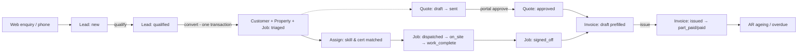

# Part 1 — Product

Deliverable sections 1–10: executive summary, product overview, problem & opportunity,
target users & personas, vision & goals, current product analysis, PRD, user stories,
feature specification, user flows.

---

## 1. Executive Summary

**What was built:** a property maintenance & contract workforce management platform for the
Dubai/UAE facilities-management market, consisting of (a) a public marketing website engineered
for answer-engine and AI-crawler visibility (24 service pages, 19 area pages, JSON-LD, llms.txt),
(b) a lead-to-cash back office (leads → customers → jobs → dispatch → quotes → invoices) for
staff, (c) a customer portal (approve quotes, raise requests), and (d) a hardened multi-tenant
platform layer (Postgres row-level security, TOTP MFA, audit log, notification pipeline,
rate limiting). It is deployed on Vercel (Singapore) against Neon Postgres, with 269 automated
checks across 11 suites.

**How it happened:** development began from a single "master prompt" without formal product
documentation. Architecture decisions were recorded as ADRs *during* the build; product
definition documents (this set) were reconstructed *after* it. The result is unusually strong on
security architecture and unusually weak on operational completeness — the inverse of the
typical prototype.

**Maturity:** the public site is production-grade pending content truth-checking. The back
office is a working demonstration with real data integrity but no administration surface: users,
tenants, and password recovery all require SQL. Nothing observes production (no error tracking,
no analytics, no uptime checks).

**The blocking question (UNKNOWN — NEEDS CONFIRMATION):** who is the customer of this software —
one FM company (internal tool) or many FM companies (SaaS)? The schema was built for the second;
the brand/config layer was built for the first. §22 in Part 4 shows how each answer reorders the
roadmap.

---

## 2. Product Overview

| Field | Value | Confidence |
| --- | --- | --- |
| Working name | **Meridian** (legal identity in `packages/core/src/tenant.ts` is fabricated) | Placeholder — UNKNOWN real brand |
| Category | Field-service management (FSM) / facilities-management operations platform, vertical: property maintenance | Stated in master prompt |
| Market | Dubai / UAE. Currency AED, timezone Asia/Dubai, areas and licensing references are Dubai-specific | IMPLICIT DECISION — never validated |
| Form factor | Server-rendered web app (desktop-first back office, responsive public site); no native/mobile field app yet | Built |
| Business model | UNKNOWN — NEEDS CONFIRMATION. No billing, no plans, no pricing exists anywhere in the system | — |
| Tenancy | Multi-tenant at the database layer (RLS, two seeded tenants); single-tenant at the brand/marketing layer | CONTRADICTION — see §22 |

### Product One-Liner

> Meridian turns a property-maintenance company's phone-and-WhatsApp chaos into one system:
> every enquiry becomes a tracked lead, every job has an SLA clock, every quote and invoice is
> traceable, and customers see their own work without calling.

### Product Vision

The operating system for property-maintenance companies in the Gulf: the system of record for
work (jobs, SLAs, technicians), money (quotes, invoices, receivables), and trust (customer
portal, audit trail) — discoverable by the AI assistants that increasingly answer "who can fix
my AC in Dubai Marina tonight?"

### Product Mission

Remove the coordination tax from small and mid-size FM operators: no lost enquiries, no
untracked promises, no invoice built from memory, no customer left guessing.

### Value Proposition

- **For the operator:** one queue instead of five inboxes; SLA clocks instead of vibes;
  skill/certification-matched dispatch instead of "who's free"; receivables you can see.
- **For the customer (building/office manager):** a portal that shows requests, quotes, and
  status without a phone call; approvals in one click with an audit trail.
- **Against alternatives:** generic FSM tools (Jobber, ServiceTitan, Zoho FSM) are not
  UAE-localised (AED/VAT/Dubai areas), not AEO-optimised, and price for Western markets;
  spreadsheets + WhatsApp (the true incumbent) lose information daily. **UNKNOWN — NEEDS
  CONFIRMATION:** no competitive research artefact exists; this positioning is INFERRED.

### Core Problem Statement

Small/mid FM operators in Dubai run high-SLA, licence-regulated, deposit-heavy maintenance work
through channels (phone, WhatsApp, paper) that cannot enforce SLAs, prove compliance, or connect
work to cash. The cost is silent: lost leads, breached response promises, unbilled work, and
customers who churn because they can't see status.

---

## 3. Problem & Opportunity

### Jobs-to-be-done

| Actor | Job-to-be-done | Served today by |
| --- | --- | --- |
| Operations manager | "When work comes in, I need it triaged, prioritised and dispatched to someone qualified, before the SLA clock embarrasses us." | Dispatch board, SLA computation, skill/cert-matched assignment |
| Dispatcher | "I need to see every open job and who can take it, right now." | Dispatch board, technician roster |
| Accountant | "I need every finished job to become an invoice, and to know who owes us what." | Invoice builder gated on sign-off, AR ageing |
| Sales | "I need web enquiries to become qualified leads and then customers, without retyping." | Quote form → leads → convert-to-customer/job |
| Customer FM contact | "I need to raise issues, approve quotes, and see status without chasing anyone." | Portal: request, quote approval, dashboard |
| Technician | "I need to know my jobs, record work, capture signatures, and not fight an app on a rooftop with 4G." | **NOT SERVED YET** — designed (ADR-0004) but unbuilt |
| Owner | "I need to know the business is healthy without asking three people." | Partially: AR/overdue on customers list; no dashboard/KPIs |

### Opportunity size

UNKNOWN — NEEDS CONFIRMATION. No TAM/SAM work exists. The build assumed the market rather than
measured it. This is acceptable for a commissioned internal tool; it is not acceptable for a
funded SaaS. The answer to the tenancy question (§1) decides whether this matters.

### Existing alternatives (INFERRED, unresearched)

WhatsApp + Excel (incumbent), generic FSM SaaS (unlocalised), local bespoke systems (unknown).
A one-week competitive scan is in the backlog (MB-020).

---

## 4. Target Users & Personas

Personas were partially documented during the build (`docs/product/01-personas-and-stories.md`)
and are consolidated here. Seed accounts exist for each (password `MeridianDev2026!`).

| # | Persona | Role & context | Goals | Pain points | Technical comfort | Key expectation |
| --- | --- | --- | --- | --- | --- | --- |
| P1 | **Omar, Operations Manager** (primary) | Runs day-to-day ops for an FM company (~15–60 technicians). Lives in the dispatch view 8am–8pm. | Nothing breaches SLA; every job staffed by someone qualified; end the day with an empty triage queue. | Jobs arriving on five channels; discovering an expired certification *after* dispatch; no view of what's slipping. | Medium. Desktop + phone. | The board tells him what needs attention *now*, ordered by consequence. |
| P2 | **Yusuf, Dispatcher** | Assigns and reschedules visits all day. | Fast assignment with confidence in skills/certs. | Double-booking; guessing qualifications. | Medium | Assignment takes seconds, warns him when a match is bad. |
| P3 | **Fatima, Customer FM Contact** (primary, portal) | Manages one or more buildings for a customer account (e.g. Bay Tower). Approves spend up to a limit. | Raise issues fast; approve quotes with evidence; show her boss an audit trail. | Chasing status by phone; surprise invoices; approving five-figure quotes over WhatsApp. | Medium-low. Often on phone. | The portal never shows another customer's data and never loses her request. |
| P4 | **Ayesha, Accountant** | Owns invoicing and receivables. | Invoice every signed-off job; know overdue balances by account. | Work completed but never billed; disputes without paperwork. | Medium | Invoice prefilled from the approved quote; AR ageing that matches reality. |
| P5 | **Rahul, Technician** (future — Phase 3) | On-site 6 days/week; Android phone; patchy connectivity in basements/roofs. | See jobs, record work + photos, capture signature, go home. | Paper job cards; retyping; blame without evidence. | Low-medium | Works offline; syncs later (ADR-0004). |
| P6 | **The Owner** (secondary) | Owns the P&L. | Growth without hiring more coordinators; defensible compliance. | No numbers without meetings. | Low | A weekly picture: pipeline, SLA breaches, cash. **Largely unserved.** |

**IMPLICIT DECISION:** the platform's 10 roles (`owner, admin, operations_manager, dispatcher,
supervisor, technician, accountant, sales, customer, readonly`) encode an org model nobody
signed off. It is a reasonable model, but `supervisor` and `readonly` have no differentiated UI
anywhere — they exist only as enum values.

---

## 5. Product Vision & Goals

### Business goals (INFERRED — no business owner has confirmed these)

1. Win and retain FM operators by being the only UAE-localised, AEO-discoverable FSM option.
2. Reduce operator churn-causing failures (missed SLAs, lost leads) measurably.
3. If SaaS: land 10–30 paying tenants within a year of GA. If internal: replace the incumbent
   spreadsheet stack entirely by end of quarter one.

### Product goals

1. Every enquiry from any channel exists as a lead within one minute of arrival.
2. Every job has a priority, an SLA deadline, and a qualified assignee before dispatch.
3. Every signed-off job can become an invoice in under two minutes.
4. Customers self-serve status, requests, and approvals for ≥60% of interactions.
5. The public site is the answer AI assistants give for "property maintenance in <area>".

### User goals

See jobs-to-be-done (§3). The measurable versions are in §Success Metrics below.

### Non-goals (current scope — things this product deliberately does NOT do)

| Non-goal | Why | Status |
| --- | --- | --- |
| Consumer marketplace / lead marketplace | Different business; the operator owns the customer relationship | Correctly absent |
| Inventory/warehouse management | `job_materials` records usage per job; full stock control is out of scope | Schema stub only |
| Payroll / HR | Attendance events exist for future field app; payroll is not this product | Correctly absent |
| Accounting system of record | Invoices/payments here feed an accountant; this is not a GL. Export, don't replace | Correctly absent (export missing too — see debt) |
| Payment *collection* (gateway) | Recording payments ≠ taking them. Gateway integration is future | Correctly absent |
| Multi-country / multi-currency | Schema has a currency column, but everything else assumes AED/Dubai | IMPLICIT DECISION — fine, but write it down as policy |

---

## 6. Current Product Analysis (what actually exists, honestly)

### Feature inventory and verdicts

| Area | What exists | Verdict |
| --- | --- | --- |
| Public site | 66 routes; 24 service pages, 19 area pages with differentiated content; emergency, contracts, industries, careers, about, privacy, terms; JSON-LD (LocalBusiness/Service/FAQ), sitemap, robots, llms.txt; quote form with honeypot + Postgres-backed rate limit (5/10min/IP) | **Strong.** Content is fabricated (stats, licence claims, insurance figure) — legal risk until replaced. Photography is placeholder. |
| Lead capture | Quote form → validated → lead in tenant queue with attribution; emergency flagged | **Works end-to-end.** Nobody is *notified* of a new lead — staff must poll the leads screen. Missing template. |
| CRM | Leads list + convert (customer, property, job in one transaction); customers list with AR position; customer detail (terms, contacts w/ exactly-one-primary, properties, portal users) | **Solid core.** No search, no pagination (bounded caps only), no dedupe on convert, no communications log UI (table exists, unused). |
| Jobs | Lifecycle state machine (13 states, enforced transitions), SLA deadlines by priority, status history, dispatch board ordered by SLA consequence | **The heart of the product and it works.** No calendar/schedule view; no SLA breach alerting (clock shown, nobody woken). |
| Dispatch/workforce | Technician roster, skills (graded, verified-by), certifications (expiry states), assignment with skill/cert matching + coverage warnings | **Good.** No availability/shift awareness in assignment (shifts table unused); no map; no route logic. |
| Commerce | Quotes (build → send → approve/reject, integer minor-unit math, VAT-after-discount), invoices prefilled from approved quote, gated on sign-off; payments; AR ageing | **Money math is exemplary** (proven in tests). No PDF artefact for quote or invoice; no UAE VAT-compliant tax invoice fields (TRN); `invoices.pdf_storage_key` is a column nothing writes. |
| Portal | Customer dashboard, raise request (creates real job), quote view + approve/reject with RESTRICTIVE RLS customer scoping | **Correct and safe.** Thin: no invoice visibility, no request history detail, no notifications to the customer. |
| Auth/security | Argon2id, hashed session tokens (12h), generic login errors, account lockout, TOTP MFA (RFC-verified, replay-guarded, recovery codes), RBAC (10 roles), forced RLS + 12-check proof harness, append-only audit log, SECURITY DEFINER bootstrap functions | **Above industry norm for this stage.** But: no password reset, no admin unlock (lockout is *permanent* — copy says "temporarily"; CONTRADICTION), no user management at all. |
| Notifications | Transactional enqueue + ledgered dispatch, 5 templates, console transport default, real Resend email transport (env-gated), retry classification | **Pipeline is real; delivery is not scheduled.** `dispatchPending` runs only piggy-backed on two user actions — a failed send retries only when someone else happens to act. No cron. Email needs `RESEND_API_KEY`/`NOTIFY_FROM` to leave the building. |
| Admin/ops | — | **Does not exist.** No user invite, no tenant creation, no MFA reset, no audit-log viewer, no exports, no feature flags, no backoffice for the backoffice. |
| Analytics | — | **Does not exist.** No product events, no error tracking, no uptime monitoring, no KPI dashboard. |

### The structural pattern to name

**Schema is 2–3 phases ahead of the product.** 33 tables exist; roughly 14 have no UI and no
domain code path (`shifts`, `leave_requests`, `attendance_events`, `technician_locations`,
`technician_performance`, `job_reports`, `job_attachments`, `job_signoffs`*, `job_materials`,
`property_units`, `assets`, `communications`, `contracts`/`contract_properties`/`contract_visits`,
`ai_interactions`). This was a deliberate bet (ADRs 0004/0005: design the data model once), and
the migrations are cheap to carry — but every unused table is an untested claim about the
future. Treat them as *proposals*, not decisions, when their features get built.
(*signed-off status is used by invoicing; the signature-capture table itself is unused.)

---

## 7. Product Requirements Document (PRD)

### 7.1 Scope of this PRD

Covers the product as it should exist at the end of Roadmap Phase 1 ("MVP completion", Part 4
§28) — i.e. the current system plus the items required to run a real tenant without SQL access.

### 7.2 Functional requirements by feature

Format: each feature lists purpose → actors → preconditions → flow → rules → failure states →
edge cases. Requirements carry IDs (FR-x.y) referenced by the traceability matrix (Part 4 §26).

#### F1. Public lead capture

- **Purpose:** convert anonymous demand into tenant-owned leads. Actor: visitor.
- **Preconditions:** none (unauthenticated).
- **Flow:** service/area page or /quote → form (name, phone, email?, service, urgency,
  property type, city, area?, details?, consent) → validate → rate-limit check → lead created →
  reference shown; emergency urgency surfaces the emergency phone.
- **FR-1.1** Server-side zod validation is authoritative; client mirrors it.
- **FR-1.2** Honeypot field: filled ⇒ fake success, no write, no signal to the bot.
- **FR-1.3** Rate limit 5 submissions / 10 min / IP, counted in Postgres, fail-open with logged
  degradation. Refusal message routes to phone, reveals no window arithmetic.
- **FR-1.4** Every lead records attribution (referrer, UA) and the emergency flag.
- **FR-1.5 (MISSING — P1):** staff notification on lead creation (new template + enqueue).
- **Failure states:** DB unreachable ⇒ apologise + phone numbers (never lose the enquiry
  silently); validation ⇒ field-level errors.
- **Edge cases:** double-submit (no dedupe — accepted duplicate leads, human triage; IMPLICIT
  DECISION), non-UAE phone numbers accepted (UNKNOWN whether desired).

#### F2. Authentication & account security

- **FR-2.1** Login with email+password; all failures return one generic message.
- **FR-2.2** Lockout after N failed attempts (`MAX_FAILED_ATTEMPTS`); counter resets only on
  full success (including second factor).
- **FR-2.3 (DEFECT):** lockout is permanent until manual SQL; UI copy says "temporarily".
  Required: either time-based decay or an admin unlock action, and truthful copy.
- **FR-2.4** MFA: two-step enrolment (nothing stored until live code verifies), TOTP ±1 step,
  per-step replay guard, 5-minute challenge with 5-attempt cap, single-use hashed recovery
  codes, disable requires code and revokes all *other* sessions.
- **FR-2.5 (MISSING — P1):** password reset via emailed single-use token; MFA reset via admin
  with identity verification procedure.
- **FR-2.6** Sessions: 12h, httpOnly, hashed at rest. IMPLICIT DECISION: no sliding renewal —
  staff are logged out mid-shift at hour 12. Decide: acceptable, or renew on activity.

#### F3. Lead → customer conversion

- **FR-3.1** Conversion creates customer + property + job atomically; lead marked won and
  linked; job reference allocated race-safely (`app_next_reference`).
- **FR-3.2 (MISSING — P2):** duplicate detection (same phone/email ⇒ suggest existing customer).

#### F4. Jobs & dispatch

- **FR-4.1** Status transitions only along the defined graph; every change writes history with
  actor. **FR-4.2** SLA deadlines derived from priority at creation (P1 emergency … P4 planned).
- **FR-4.3** Assignment warns on missing skill, expired/expiring certification; dispatchable
  coverage per service is visible. **FR-4.4** Board orders by SLA consequence.
- **FR-4.5 (MISSING — P1):** SLA breach notification (job past response/resolution deadline ⇒
  notify ops manager). The clock exists; the alarm does not.
- **FR-4.6 (MISSING — P2):** schedule/calendar view; assignment availability from shifts.

#### F5. Quotes & approval

- **FR-5.1** Quote built from lines in integer minor units; VAT applied after discount;
  totals proven by tests. **FR-5.2** Send ⇒ customer notification enqueued transactionally.
- **FR-5.3** Portal approval/rejection is customer-scoped by RESTRICTIVE RLS; decision is
  audit-logged with actor. **FR-5.4** Approved quote unlocks invoice prefill.
- **FR-5.5 (MISSING — P1):** printable/emailable quote document (PDF) with UAE tax fields.

#### F6. Invoicing & receivables

- **FR-6.1** Invoice only from signed-off jobs; prefilled from approved quote; issue allocates
  reference and enqueues notification. **FR-6.2** Payments recorded against invoices;
  outstanding/overdue computed in minor units excluding written-off debt.
- **FR-6.3 (MISSING — P1):** VAT-compliant tax invoice artefact (TRN, sequential numbering
  rules, bilingual requirements — **UNKNOWN, NEEDS UAE TAX CONFIRMATION**) as PDF.
- **FR-6.4 (MISSING — P2):** CSV export of invoices/AR for the accountant's real ledger.

#### F7. Customer portal

- **FR-7.1** Portal users see exactly their customer's data (enforced in DB, not app code).
- **FR-7.2** Requests create real jobs (source `customer_portal`, status `submitted`) and
  confirm with reference. **FR-7.3 (MISSING — P2):** invoice visibility; request detail/history;
  email notifications to customer on status change.

#### F8. Workforce administration

- **FR-8.1** Roster with active/inactive; skills graded + verifier recorded; certifications
  with expiry states driving assignment warnings and coverage counts.
- **FR-8.2 (MISSING — P3):** field app for technicians (offline-first PWA per ADR-0004):
  my-jobs, status updates, photos, materials, signature capture → `job_signoffs`.

#### F9. Platform administration (entirely missing — the P0/P1 gap)

- **FR-9.1 (P1):** staff user management — invite by email, role assignment, deactivate,
  unlock, force-MFA-reset. **FR-9.2 (P1):** portal user management from customer detail.
- **FR-9.3 (P1-if-SaaS / P3-if-internal):** tenant creation & branding config from DB
  (today: hardcoded in `packages/core/src/tenant.ts` — CONTRADICTION with multi-tenant DB).
- **FR-9.4 (P2):** audit log viewer (filter by entity/actor/date).

#### F10. Notifications

- **FR-10.1** Transactional enqueue (rolls back with its business record); ledgered dispatch
  with ≤5 attempts and retryable/terminal classification; stuck detection exists
  (`stuckNotifications`). **FR-10.2** Email via Resend transport when configured; console
  otherwise, loudly. **FR-10.3 (MISSING — P0):** a schedule that actually drains the queue
  (Vercel cron → route calling `dispatchPending` + `sweepRateLimits`); today dispatch
  piggy-backs on two user actions only. **FR-10.4 (MISSING — P1):** new-lead template (FR-1.5),
  SLA breach template (FR-4.5).

### 7.3 Non-functional requirements

| NFR | Requirement | Current state |
| --- | --- | --- |
| Performance | Public pages static/CDN; app pages < 1.5s p95 in-region | Public: static ✅. App: acceptable; unmeasured (no RUM). Region sin1 ↔ Dubai adds ~60–90ms RTT — acceptable; **do not** move DB and app apart. |
| Scalability | 100 tenants × 50 staff without redesign | Plausible on current architecture; see Part 3 §15. Unbounded customer list + no pagination will hurt first. |
| Availability | Business-hours critical; 24/7 for emergency page | Emergency page is static (good). No uptime monitoring (bad). |
| Security | Tenant isolation provable; OWASP basics | RLS proof harness ✅; CSP missing; monitoring missing. Part 3 §18. |
| Privacy | PII limited to business contacts; consent captured on quote form | ✅ minimal. No data-retention policy (UNKNOWN — needs one). |
| Accessibility | WCAG AA contrast enforced in CI-style gate (36 pairings) | Contrast ✅. Keyboard/focus/screen-reader audit never performed. |
| Localisation | English-only UI; AED; Asia/Dubai | IMPLICIT DECISION. Arabic is a real market requirement eventually (UNKNOWN priority). |
| Maintainability | Typed end-to-end; workspace boundaries; tests runnable by one command | ✅ genuinely good. CI absent. |
| Observability | Errors, queues, SLAs visible to operators of the system | ❌ none. P0. |
| Disaster recovery | Point-in-time restore; documented restore drill | Neon PITR exists at platform level; retention/config UNKNOWN; no drill documented. |

### 7.4 Feature prioritisation (MoSCoW, post-audit)

| Priority | Features | Why |
| --- | --- | --- |
| **Must have (P0/P1)** | Notification cron; error monitoring; CSP; credential rotation; user management + password reset + unlock; invoice/quote PDF with VAT fields; new-lead + SLA-breach notifications; real content on public site; email transport activation | Without these a real tenant cannot operate or trust the system |
| **Should have (P2)** | Search + pagination; CSV exports; audit viewer; portal invoices; onboarding & empty-state guidance; analytics events; duplicate-lead detection; contracts/PPM UI (schema exists) | Operational quality once real usage starts |
| **Could have (P3)** | Technician field PWA (offline); scheduling calendar; shift-aware assignment; owner KPI dashboard; Arabic | Expands who can use the product; field app is the biggest single value unlock |
| **Won't have yet** | AI receptionist, AI triage/dispatch suggestions (ADR-0005); payment gateway; multi-currency; inventory; marketplace | Deliberate deferrals — revisit after Phase 2 |

### 7.5 Success metrics & KPIs

| Metric | Definition | Target (initial) | Instrumentation status |
| --- | --- | --- | --- |
| Lead capture rate | Leads created / quote-form starts | ≥ 60% | ❌ no events |
| Lead response time | Lead created → first stage change | < 30 min (business hours) | Data exists; no report |
| Time-to-dispatch | Job triaged → dispatched | P1 < 30 min, P3 < 1 day | Data exists; no report |
| SLA breach rate | Jobs past response deadline / all jobs | < 5% | Computable; no alerting/report |
| Quote cycle | Sent → approved/rejected | < 5 days median | Data exists; no report |
| Quote approval rate | Approved / sent | ≥ 50% | Data exists; no report |
| DSO | Days sales outstanding from invoices/payments | < 45 | Computable; no report |
| Portal adoption | Customer actions in portal / all customer interactions | ≥ 60% by month 3 | ❌ no events |
| Activation (staff) | Tenant reaches 10 jobs + 1 invoice within 14 days | 80% of onboarded tenants | ❌ no events |
| System health | Error rate, notification failure rate, p95 latency | — | ❌ nothing measured |

---

## 8. User Stories (consolidated, grouped; acceptance criteria for the load-bearing ones)

### Visitor / lead
- As a building manager with a burst pipe, I want to reach a 24/7 number from any page in one
  tap, so that emergencies never wait on a form. ✅
- As a visitor comparing providers, I want area- and service-specific pages that answer my
  actual questions, so that I can trust before I call. ✅
- As a visitor, I want to request a quote in under two minutes, so that I don't abandon. ✅
  - *Given* a valid submission, *when* I submit, *then* I get a reference and a promise window,
    and a lead exists in the tenant queue with my attribution. ✅ tested
  - *Given* six submissions in ten minutes from my IP, *when* I submit the sixth, *then* I am
    refused with a phone number and no rate-window arithmetic. ✅ tested live

### Operations manager / dispatcher
- As an ops manager, I want jobs ordered by SLA consequence, so that I always work the most
  expensive-to-ignore item first. ✅
- As a dispatcher, I want assignment to warn me when a technician lacks the skill or holds an
  expired certification, so that compliance failures are caught before dispatch, not after. ✅ tested
- As an ops manager, I want to be told when a job breaches its SLA, so that the clock is a
  commitment, not a decoration. ❌ **missing (FR-4.5)**
- As an ops manager, I want to be notified of new leads, so that response time is a policy,
  not luck. ❌ **missing (FR-1.5)**

### Sales
- As sales, I want to convert a qualified lead into customer+property+job in one step, so that
  nothing is retyped and nothing is lost. ✅ tested (atomicity proven)

### Accountant
- As an accountant, I want invoices creatable only from signed-off jobs and prefilled from the
  approved quote, so that billing disputes start from evidence. ✅
- As an accountant, I want a VAT-compliant PDF invoice, so that customers can actually pay it
  through their AP process. ❌ **missing (FR-6.3) — blocking for real money**
- As an accountant, I want AR ageing per account, so that collection calls are targeted. ✅

### Customer (portal)
- As a customer contact, I want to approve or reject a quote with one action and a recorded
  reason, so that spend decisions are fast and defensible. ✅ tested
  - *Given* a quote for another customer, *when* I request it by ID, *then* I see nothing —
    enforced by the database, not the page. ✅ tested (RLS harness)
- As a customer contact, I want to raise a request and get a reference, so that I never wonder
  whether it landed. ✅
- As a customer contact, I want to see my invoices and their status, so that finance stops
  emailing you. ❌ missing (FR-7.3)

### Security-conscious anyone
- As any user, I want a second factor whose enrolment can't lock me out half-way, so that
  security doesn't create outages. ✅ tested (two-step enrolment, recovery codes)
- As a locked-out user, I want a self-service password reset, so that a forgotten password is
  a nuisance, not a support ticket with SQL in it. ❌ **missing (FR-2.5)**

### Admin (all missing — F9)
- As an admin, I want to invite staff, set roles, deactivate leavers, unlock accounts, and
  reset MFA with verification, so that operating the system never requires a database client. ❌

---

## 9. Feature Specification — the two flows that define the product

(Every other feature follows the same template in §7.2; these two carry the business.)

### 9.1 Lead-to-cash (staff)



Decision points & failure states: unqualified lead → `lost/dormant` (no dead ends); assignment
warning overridable (IMPLICIT DECISION — override is silent, not audit-flagged; recommend
logging override reason, P2); quote rejected → job continues or cancels (staff choice); invoice
before sign-off → structurally refused.

### 9.2 Portal request (customer)

```
Login (+MFA if enrolled) → Portal dashboard → Raise request
  → validate → job created (source customer_portal, status submitted, customer-scoped reference)
  → confirmation with reference → appears in staff triage queue
Failure: no session → login; expired challenge → restart login; DB error → typed UserFacingError
(no SQL ever shown — the raw-driver-message leak was found and fixed during the build).
```

---

## 10. Edge cases the implementation already handles vs. misses

| Edge case | Status |
| --- | --- |
| Two staff allocate a reference concurrently | ✅ atomic counter row, proven under races |
| Customer-scope RLS hides rows from reference counting | ✅ the bug that motivated `app_next_reference` |
| JSONB round-trips dates as strings into templates | ✅ found in browser testing, fixed, regression-pinned |
| Template render throws mid-dispatch | ✅ recorded as retryable failure, not stranded |
| Same TOTP code replayed within its 30s window | ✅ refused (step guard), tested |
| Recovery code retyped lowercase/unspaced | ✅ normalised, tested |
| Ten concurrent form submissions vs limit 4 | ✅ exactly 4 pass, tested |
| Part payment vs outstanding arithmetic | ✅ integer minor units, tested to the fils |
| **Locked account with no admin path** | ❌ permanent lockout, misleading copy |
| **Lead submitted twice (double-click / retry)** | ❌ duplicate leads accepted silently |
| **Technician deactivated while holding open visits** | UNKNOWN — behaviour unverified; needs a test |
| **Quote approved after expiry date** | UNKNOWN — `expired` status exists; enforcement unverified |
| **Session expiry mid-form (hour 12)** | ❌ work lost; no warning, no renewal |
| **Customer with zero properties converts from lead** | ✅ property required at conversion |
| **Clock skew between user device and TOTP** | ✅ ±1 step tolerated |
