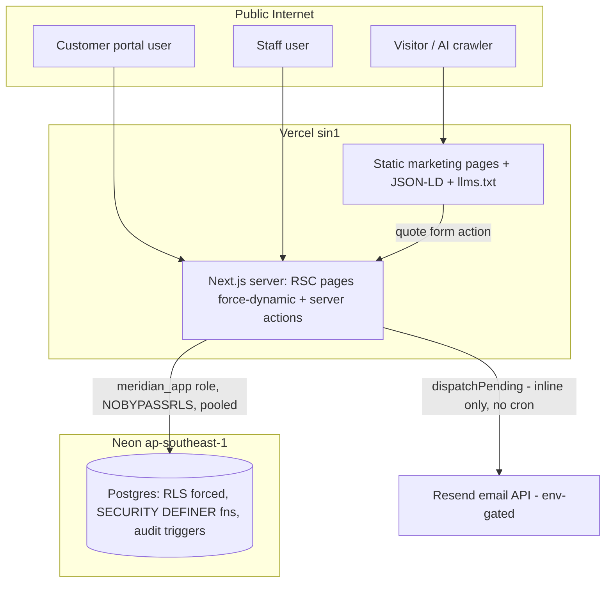
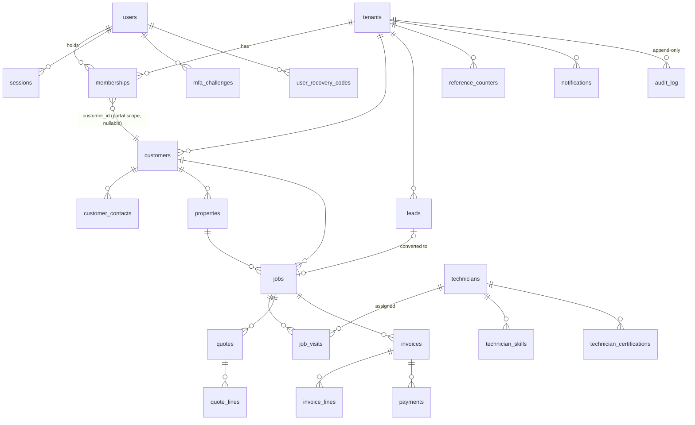

# Part 3 — Technical

Deliverable sections 14–21: technical requirements, system architecture, database architecture,
API architecture, security architecture, technical design, testing strategy, analytics &
observability.

---

## 14. Technology stack — what, why, verdict

| Technology | Role | Why it was chosen | Verdict |
| --- | --- | --- | --- |
| Next.js 16 (App Router, RSC) | Web app + static marketing + server actions | One deployable serves crawler-critical static HTML *and* the authenticated app | ✅ Right. The AEO requirement alone justifies RSC. |
| React 19 | UI | Comes with Next 16 | ✅ |
| Tailwind v4 + CSS tokens | Styling | Token-driven theming, contrast gate | ✅ |
| TypeScript 7, strict | Everywhere | — | ✅ |
| PostgreSQL 16/18 (Neon) | System of record | RLS is the tenant boundary; serverless-friendly | ✅ Right. Neon free-tier limits (cold starts, connections) are the price — acceptable now. |
| Drizzle ORM + `postgres` driver | Data access | Typed schema, raw-SQL escape hatch, `prepare:false` for poolers | ✅. Migrations are generated but **applied by hand** — gap, see §24. |
| `@node-rs/argon2` | Password hashing | OWASP params, native speed | ✅ (kept out of serverless bundle via `serverExternalPackages`) |
| npm workspaces (5 packages) | Monorepo | `core` (pure domain), `db`, `auth`, `notify`, `web` | ✅ boundaries are real: `core` has zero runtime deps |
| Vercel (sin1) + Neon (ap-southeast-1) | Hosting | Co-located compute+DB; static CDN for marketing | ✅ for now. Vendor coupling is acknowledged, not dangerous. |
| Resend (HTTP) | Email transport | Single POST + idempotency header; no SDK, no SMTP-on-serverless | ✅ design; ❌ not yet activated (env unset) |
| Hand-written TOTP/QR (`totp.ts`, `qr.ts`) | MFA enrolment | A hosted QR API would exfiltrate the shared secret | ✅ justified **because** proven: RFC 6238 vectors + a decoder in tests. Unusual choice, correctly de-risked. |

**Should anything be replaced? No.** The stack is coherent and boring in the right places. The
risks are operational (no CI, no monitoring), not architectural.

## 15. System architecture

Request path for every tenant-scoped read/write: session cookie → `resolveSession` (hashed
token) → `withTenant()` / `withCustomerScope()` opens a transaction, sets `app.tenant_id` /
`app.user_id` / `app.customer_id` GUCs transaction-locally → RLS policies filter every query.
A query missing its WHERE clause returns nothing, not other tenants' data.

**Scale picture:** 100 users — nothing to do. 10,000 users / ~100 tenants — fine
architecturally; first fires: unbounded list queries (customers list has no cap), Neon
connection budget (pool max 3/instance × N instances; move to pooled + consider PgBouncer
budget), and dispatch-board query fan-out. 100,000+ users — this is a different product tier;
you would introduce read models/caching, background workers (real queue, not cron-drain),
and likely dedicated Postgres. **Nothing in the current design blocks that path** — the tenant
boundary being in the DB is what makes horizontal app scaling trivial.

## 16. Database architecture

33 tables. Core relationships (built + used):

Conventions that carry the design: `tenant_id` first column on every tenant table + generic
RLS policy loop (a new table cannot be forgotten — re-running `rls.sql` covers it); money as
`numeric(14,2)` at rest, integer minor units in code, conversion at the edges; soft delete via
`deleted_at`; enums for all state machines; `audit_log` is INSERT-only for the app role
(UPDATE/DELETE revoked and policy-blocked).

**Unused-table register (schema ahead of product — see Part 1 §6):** `shifts`,
`leave_requests`, `attendance_events`, `technician_locations`, `technician_performance`,
`job_reports`, `job_attachments`, `job_signoffs`, `job_materials`, `property_units`, `assets`,
`communications`, `contracts`, `contract_properties`, `contract_visits`, `ai_interactions`.
Each is a Phase-3/4 bet. They cost little, but **do not treat their shapes as decided** —
re-validate against the real feature when it's built.

Indexing: FK + hot-path indexes exist (`memberships_tenant_user_key`,
`reference_counters_key`, status/tenant composites). No slow-query evidence yet because nothing
measures queries — see §21.

## 17. API architecture

**IMPLICIT DECISION, worth making explicit: there is no REST/GraphQL API.** The entire mutable
surface is Next.js **server actions** (POST-only, CSRF-protected by Next's action-ID mechanism,
co-located with their screens), plus three GET route handlers (`sitemap`, `robots`, `llms.txt`).

| Action (file) | Auth | Writes | Side effects |
| --- | --- | --- | --- |
| `submitQuoteRequest` (marketing/quote) | none (rate-limited, honeypot) | lead | — (notification MISSING) |
| `signIn`, `verifyMfa` (login) | credentials / MFA cookie | session, challenge, attempts | lockout counting |
| `beginEnrolment`, `confirmMfa`, `turnOffMfa` (security) | session | user MFA fields, recovery codes | revoke other sessions |
| `saveTerms`, `createContact`, `deleteContact`, `createProperty` (customers/[id]) | staff | customer graph | audit log |
| lead `convert` (leads) | staff | customer+property+job+lead | reference allocation |
| job transitions, `assign`, quote build/send, `raiseInvoiceAction` (jobs/[id]) | staff | jobs/visits/quotes/invoices | notifications enqueued transactionally; `dispatchPending` piggy-backed |
| portal `decide` (quotes/[id]), `createRequest` (request) | customer scope | quote status / job | notifications; `dispatchPending` piggy-backed |

Consequences to accept knowingly: no third-party integration surface (a future public API is a
Phase-3/4 project, not a refactor — domain functions in `packages/db` are already the reusable
layer); no API versioning concerns today; mobile field app (Phase 3) will need either server
actions from the PWA or a thin `/api` layer — decide then.

## 18. Security architecture (review)

**Strong, verified:**
- Tenant isolation in the database: `FORCE ROW LEVEL SECURITY` on every tenant table, app role
  `NOBYPASSRLS` + boot assertion, 12-check adversarial proof harness (`verify-rls.sql`) run
  against production after every schema change so far.
- Customer scoping as RESTRICTIVE policies ANDed onto tenant policies — portal code *cannot*
  widen access by forgetting a filter.
- AuthN: Argon2id; hashed session tokens (DB dump ≠ sessions); generic failure messages
  (no account enumeration); lockout counter; MFA done properly (two-step enrolment, replay
  guard, hashed single-use recovery codes, challenge ≠ session).
- SECURITY DEFINER functions with pinned `search_path` for the four unauthenticated bootstrap
  needs (auth lookup, MFA, public tenant resolve, rate limit) — each REVOKEd from PUBLIC.
- Security headers (HSTS w/ preload flag, nosniff, frame SAMEORIGIN, referrer-policy,
  permissions-policy); httpOnly cookies; no secrets in repo (`.env` ignored, examples clean).
- Input validation with zod server-side on every public form; SQL access is parameterised
  throughout (no string-built SQL anywhere in app code).
- Public quote endpoint: honeypot + DB-backed rate limit (proven under concurrency).

**Weak / missing (ranked):**
1. **Secrets incident (operational, CRITICAL until done):** two Neon owner connection strings
   were pasted into the build conversation (one belonging to an unrelated production system).
   Rotation was recommended and is **UNKNOWN — NEEDS CONFIRMATION**.
2. **No Content-Security-Policy.** Known and documented (inline JSON-LD needs nonces/hashes).
   XSS blast radius is currently mitigated only by React escaping + one reviewed
   `dangerouslySetInnerHTML` (self-generated QR SVG). Ship CSP with nonces — P0/P1.
3. **No password reset / no admin unlock** → security *causes* outages; and "temporarily
   locked" copy is false (CONTRADICTION). P1.
4. **No IP-level throttle on login** — account lockout protects one account; credential
   stuffing across many accounts is unthrottled. The Postgres limiter built for the quote form
   is reusable here in an afternoon. P1.
5. **No monitoring** — a breach or brute-force campaign would be invisible. Error tracking +
   basic auth-event alerting. P0.
6. Session fixed 12h TTL, no rotation on role change; acceptable, documented debt.
7. `x-forwarded-for` trust is proxy-dependent — documented in code; revisit if ever moved off
   Vercel.

OWASP top-10 pass: injection ✅ (parameterised), broken access control ✅ (DB-enforced, tested),
crypto failures ✅ (argon2id/SHA-256/hashed tokens), insecure design ✅ mostly (reset gap),
misconfig ⚠️ (CSP), vulnerable components ⚠️ (no dependency audit automation), auth failures
⚠️ (stuffing throttle), integrity ✅ (lockfile, no CDN scripts), logging/monitoring ❌,
SSRF ✅ (no user-supplied fetches).

## 19. Technical design notes (per subsystem, current → recommended)

| Subsystem | Current implementation | Known debt / recommended |
| --- | --- | --- |
| Reference allocation | `app_next_reference` SECURITY DEFINER, atomic counter row per tenant/prefix/year, seeds from legacy max | None. This is the pattern other teams get wrong. |
| Job state machine | Transition graph in `core`, enforced in domain layer, history rows with actor | Add SLA-breach sweep (needs cron) |
| Money | Integer minor units in `core` (`toMinor`, `computeTotals` w/ VAT-after-discount), `numeric` at rest, tests to the fils | Add invoice PDF + UAE VAT fields (TRN) before real billing |
| Notifications | Transactional enqueue; ledger with attempts/claim via `FOR UPDATE SKIP LOCKED`; throwing templates recorded not stranded; stuck detection | **No scheduler.** Add Vercel cron route: `dispatchPending` + `sweepRateLimits` + `stuckNotifications` alert. P0. |
| Rate limiting | Single-statement INSERT..ON CONFLICT counter, RLS-sealed table, fail-open with degradation flag | Reuse for login IP throttle; schedule sweep |
| MFA/TOTP/QR | Hand-rolled, RFC-vector- and decoder-proven; challenge table separate from sessions | Add WebAuthn later; admin MFA-reset procedure P1 |
| Error surfacing | `UserFacingError` only renders; everything else logged + generic message | Wire the logs to an actual sink (Sentry) P0 |
| Env/config | Root `.env` loaded by next.config + db fallback loader; examples documented | Tenant identity still hardcoded in `core/tenant.ts` — the multi-tenancy contradiction. Decide (Part 4 §22). |
| Migrations | drizzle-kit generate; applied manually via psql (owner) | Add migration step to CI/deploy with checksummed order; document the six security SQL files as part of every apply |

## 20. Testing strategy

**Current (real and better than most):** 269 checks / 11 suites — integration against real
Postgres for domain, RLS, auth, MFA (negative-path heavy); RFC vectors for TOTP; an in-test QR
*decoder*; stub-server transport tests pinning retry classification; 12-check RLS adversarial
harness; 36-pair contrast gate; typecheck across 6 workspaces; `next build` as smoke.
Manual browser verification was performed for login/MFA/portal flows during the build.

**Gaps → plan:** (1) **CI does not exist** — GitHub Actions running check+tests+verify-rls
against a service Postgres, on every push, is the single highest-leverage hour available (P0).
(2) No E2E harness — add Playwright for five journeys: quote→lead, login+MFA, lead→job→assign,
quote→approve (portal), invoice raise (P2). (3) No load test — k6 script against dispatch
board + quote form before first real tenant (P2). (4) Unverified edge cases from Part 1 §10
(technician deactivation with open visits; quote expiry enforcement) need tests (P2).

## 21. Analytics & observability (specification — nothing exists today)

**Errors/infra (P0):** Sentry (server actions + RSC) with release tagging; Vercel cron
health-check; Neon connection/latency dashboards; alert on notification `failed`/stuck > 0,
auth lockout spike, quote-form degraded-limiter log line.

**Product events (P1/P2, privacy-light, no third-party cookies on marketing):**

| Event | Properties | Answers |
| --- | --- | --- |
| `quote_form_started` / `quote_form_submitted` / `quote_form_rejected` | service, urgency, area, reason | Capture funnel & spam pressure |
| `lead_stage_changed` | from, to, minutes_in_stage | Response-time KPI |
| `job_status_changed` | from, to, priority, sla_remaining | Time-to-dispatch, breach rate |
| `assignment_warning_overridden` | type (skill/cert) | Compliance risk in the open |
| `quote_sent` / `quote_decided` | amount_band, hours_to_decision | Quote cycle KPI |
| `invoice_issued` / `payment_recorded` | amount_band, days_since_signoff | Billing lag, DSO inputs |
| `portal_login` / `portal_request_created` / `portal_quote_decided` | — | Portal adoption |
| `login_failed` / `account_locked` / `mfa_enrolled` | — | Security posture |

Storage: start with a `product_events` table in the same Postgres (tenant-scoped, RLS'd) +
a weekly SQL report; graduate to a dedicated pipeline only when volume demands it. Do not
bolt on a heavyweight analytics SaaS before the KPI questions in Part 1 §7.5 are being asked.
